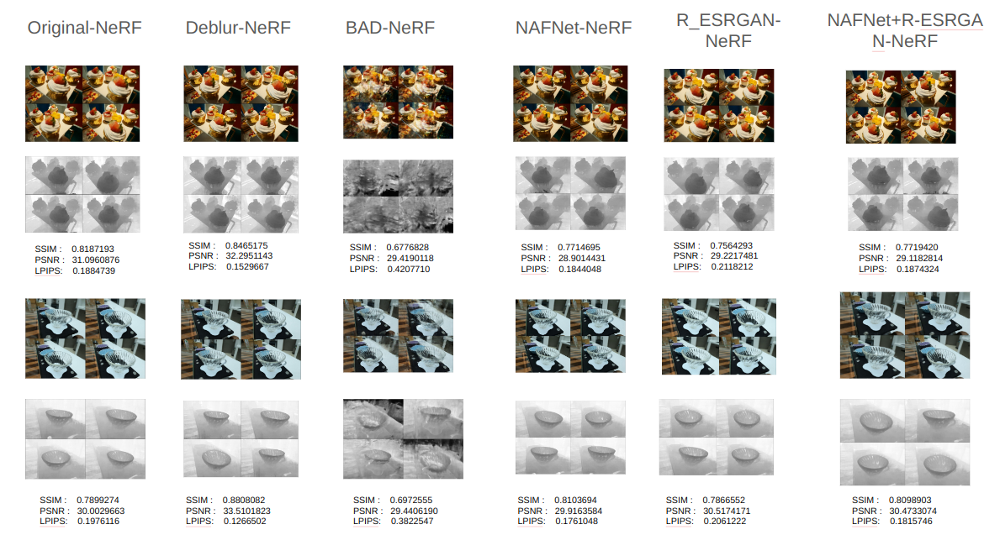

# Performance of NeRF on Real-life Deblurred Multi-view Image Dataset

## Overture
Modification of NeRF pipeline to deal with blurred images can be very costly in terms of training latency. On the other hand, if one deblurs the images before pose estimation of COLMAP, then not only would lead to better pose estimation, but also the training time would be asymptotic to original NeRF. What I am thinking is this:

|  |
|:--:|
| *Handling NeRF to deal with blurring images, by making innovations before pose estimation, instead of NeRF pipeline* |


So, in this course, I would like to propose three compositions.

* NAFNet+ NeRF
* Real-ESRGAN + NeRF
* Real-ESRGAN + NAFNet + NeRF


## Setup
### COLMAP Installation
Follow the steps mentioned [here](https://github.com/superdianuj/colmap_installation_directs)


### CONDA environment setup
```code
conda create -n nafnet python=3.8 -y
conda activate nafnet
pip install gdown
conda install pytorch==1.13.1 torchvision==0.14.1 torchaudio==0.13.1 pytorch-cuda=11.7 -c pytorch -c nvidia
cd deblur_model_nerf/NAFNet
pip install -r requirements.txt
python setup.py develop --no_cuda_ext
cd ../..
```

```code 
conda create -n torcher python=3.8 -y
conda activate torcher
pip install gdown
conda install pytorch==1.13.1 torchvision==0.14.1 torchaudio==0.13.1 pytorch-cuda=11.7 -c pytorch -c nvidia
pip install matplotlib seaborn
pip install BlurGenerator
pip install basicsr
cd deblur_model_nerf/Real-ESRGAN
pip install -r requirements.txt
python setup.py develop
cd ../..
```


### Pretrained Deblurring model download
#### NAFNet
```code
conda activate torcher
cd deblur_model_nerf/NAFNet/experiments/pretrained_models

python -c "
import gdown
try:
    url = 'https://drive.google.com/uc?id=14D4V4raNYIOhETfcuuLI3bGLB-OYIv6X'
    output = 'downloaded_file.zip'
    gdown.download(url, output, quiet=False)
except Exception as e:
    print(f'An error occurred: {str(e)}')
"
cd ../../../..
```


##### Real-ESRGAN

```code
cd deblur_model_NeRF/Real-ESRGAN/weights
wget https://github.com/xinntao/Real-ESRGAN/releases/download/v0.2.5.0/realesr-general-x4v3.pth
cd ../../..
```


### Photogammetric images folder placement

Possible dataset source: [here](https://drive.google.com/drive/folders/1_TkpcJnw504ZOWmgVTD7vWqPdzbk9Wx_)
```code
# Copy the folder <images folder> within each subdirectory of this directory
```


## Run
### Original-NeRF
```code
cd Original-NeRF
chmod +x runner.sh
./runner.sh <images folder>
```

### Deblur-NeRF
```code
cd Deblur-NeRF
chmod +x runner.sh
./runner.sh <images folder>
```

### BAD-NeRF
```code
cd BAD-NeRF
chmod +x runner.sh
./runner.sh <images folder>
```

### deblur_model-NeRF
```code
cd deblur_model-NeRF
chmod +x runner.sh
./runner.sh <images folder>
```


## Results

|  |
|:--:|
| *Comparison of NeRF variants on motion blur image dataset at 4K epochs training(Novel RGB and Depth views)* |

|  |
|:--:|
| *Comparison of NeRF variants on lens blur image dataset at 4K epochs training(Novel RGB and Depth views)* |

|  |
|:--:|
| *Evolution of training time over different NeRF variants pipelines* |


## References
This work is code organization from following repositories, would inherit the associated licences:

[1] https://github.com/limacv/Deblur-NeRF

[2] https://github.com/WU-CVGL/BAD-NeRF

[3] https://github.com/megvii-research/NAFNet

[4] https://github.com/xinntao/Real-ESRGAN

